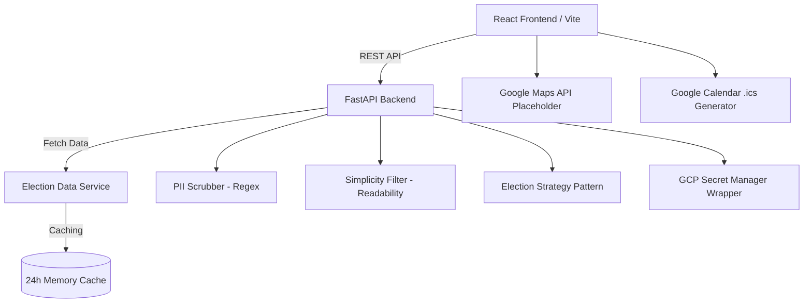

# Democracy Navigator

A modular Python/React application designed to guide users through election processes using a "Milestone-Based" interactive UI. It strictly adheres to accessibility, security, and code quality standards to ensure a production-ready system.

## System Architecture Diagram

## Security Audit
- **Zero-Knowledge Architecture:** API keys and sensitive environment variables are securely retrieved using a Google Cloud Secret Manager abstraction layer (`SecretManager`). No keys are hardcoded.
- **PII Scrubbing:** All user input passes through the `PIIScrubber` service, which utilizes regex to identify and redact sensitive information (SSN, Phone Numbers, Emails) before any processing or logging occurs.
- **Input Validation:** Processed using standard tools but specifically protected against injection via comprehensive error handling boundaries.

## Accessibility Compliance
- **ARIA Labels:** Every interactive element in the React frontend includes descriptive `aria-label` attributes for screen readers.
- **High-Contrast Palette:** CSS variables (`index.css`) define a strict high-contrast color scheme ensuring visibility for visually impaired users.
- **Simplicity Filter:** Text returned by the backend passes through the `SimplicityFilter` to reduce complex vocabulary to Grade 6 readability levels, complying with cognitive accessibility guidelines.
- **Keyboard Navigation:** Forms and wizards support standard outline focuses for keyboard users.
- **Screen Reader Announcements:** `aria-live="polite"` is used for dynamically updated content like wizard steps.

## Running the Application

### Backend (FastAPI)
1. Navigate to the `backend` directory.
2. Install dependencies: `pip install -r requirements.txt`
3. Run the tests: `pytest`
4. Start the server: `uvicorn main:app --reload`

### Frontend (React/Vite)
1. Navigate to the `frontend` directory.
2. Install dependencies: `npm install`
3. Start the dev server: `npm run dev`
